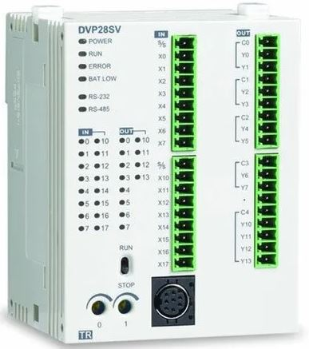
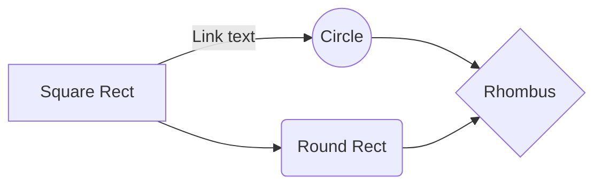
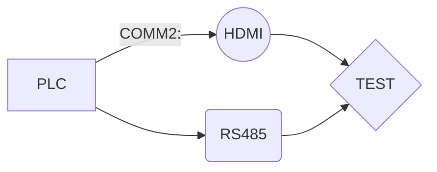

<style>
red { color: red }
yellow { color: yellow }
</style>

<red> red color markdown text</red>
<yellow> red color markdown text</yellow>

---
==MARKDOWN== KULLANIMI

### `platformio.ini`
```ini
[platformio]
lib_dir = /Users/milos/Work/arduino/esp8266-2.0.0/libraries

[env:esp01_1m]
platform = espressif
framework = arduino
board = esp01_1m
```
---

### Delta  PLC Uygulama  Notları
---
**Örnek Uygulama için Tıklayın**

---
1-Timer
2-Counter
3-Special Memory Register

* ADD
* SUB
* MUL
* DIV

Görevler
- [X] Terminal Bağlantıları
- [ ] Test verileri
- [X] ADC



> Alındı Yapılmıştır.

[PLC Program1] (http://github.com/sai-codes)

| X | Y |
|--|--|
| Buton1 | Motor 1 |
| Buton2 | Valf 1 |

#### Kod Elemanı   

```
  LD XO
     LDI X1
  OUT Y0
```

M1013 Dahili kontak için `Saniyede 1 pals` verir.


<div style="color: red; text-align: center;">   
  Renklendirmek için
</div>


The *Gamma function* satisfying $\Gamma(n) = (n-1)!\quad\forall n\in\mathbb N$ is via the Euler integral

$$
\Gamma(z) = \int_0^\infty t^{z-1}e^{-t}dt\,.
$$

And this will produce a flow chart:







